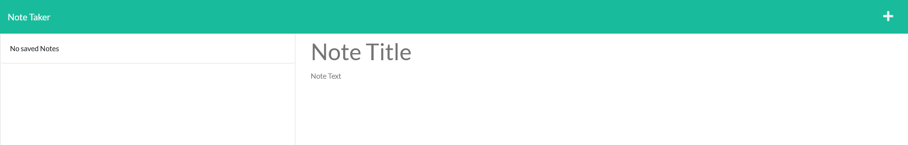
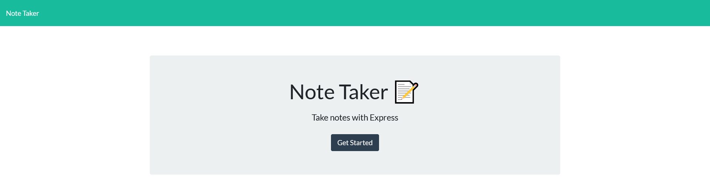

# Congenial-Note-Taker

# Description
The congenial note taker is a fullstack application that takes in user inputed notes from the frontend web page and stores them on the server. It also allows the user to delete from the database. 

# Links

[My github profile](https://github.com/AbdalehHersi)

[Congenial-Note-Taker](https://github.com/AbdalehHersi/congenial-note-taker)

# Usage

To use the application all you need to do is click on [visit the deployed webpage](https://morning-anchorage-08798.herokuapp.com/)





# Challenge acceptance criteria

```
GIVEN a note-taking application
WHEN I open the Note Taker
THEN I am presented with a landing page with a link to a notes page
WHEN I click on the link to the notes page
THEN I am presented with a page with existing notes listed in the left-hand column, plus empty fields to enter a new note title and the note’s text in the right-hand column
WHEN I enter a new note title and the note’s text
THEN a Save icon appears in the navigation at the top of the page
WHEN I click on the Save icon
THEN the new note I have entered is saved and appears in the left-hand column with the other existing notes
WHEN I click on an existing note in the list in the left-hand column
THEN that note appears in the right-hand column
WHEN I click on the Write icon in the navigation at the top of the page
THEN I am presented with empty fields to enter a new note title and the note’s text in the right-hand column
```
